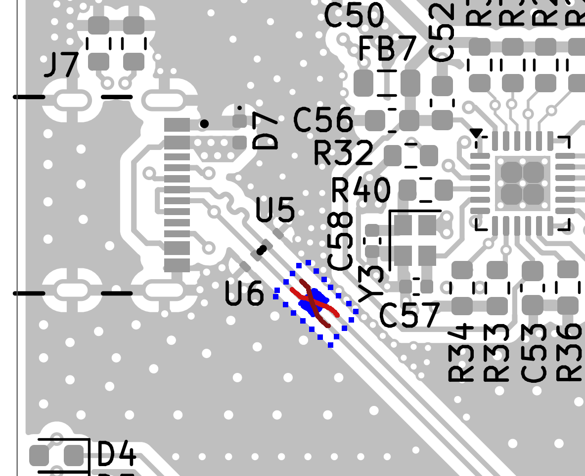

# Hardware Alpha bringup Notes

A full bill of materials can be ordered from DigiKey by uploading `bom/digikey_bom.csv`

## Errors/Fixes

1. Place 100u Electrolytic THT cap on J13 3V3 BYPASS for regulator stability
    - Should be fixed by adding 100u SMD cap to schematic/layout
2. Place 100u electrolytic THT cap on J3 5V BYPASS
    - Should be fixed by adding 100u SMD cap to schematic/layout
3. Scrape solder mask near D7 and add 4.7u ceramic 0603 or 0402 cap
    - Should be fixed with series ferite bead(or inductor) rated for inrush current near USB-C connector and 4.7u ceramic decoupling capacitor added to schematic/layout.
4. ~~C1, C46 wrong DKPN, 3.3uH inductors instead of 47uF elec caps~~
    - BOM problem; fixed in newest schematic and BOM
5. Y1 load caps should be 12pF not 12uF
    - 12pF caps will probably have a smaller footprint, needs layout fix
6. USB D+ and D- lines are swapped.
    - Needs layout fix
    - To fix existing PCBs, scrape solder mask inside blue dashed area, remove copper in blue highlighted area, and solder the two jumpers shown in red.
    - If unfixed, firmware programming and debug must be done over SWO on J4, but power can still be provided by J7
    - 

## Tested

- PoE
- USB-C Power
- Power ORing
- Power regulation
- MCU turn-on, programming, and clocks

## To be tested

- Ethernet
- WiFi
- SD Card
- RS-232
- New IIS3DWB breakout
- USB-C data/programming

*Note:* USB-DFU seemed to not be working, firmware was uploaded over JTAG. Maybe a problem with clock detection?
